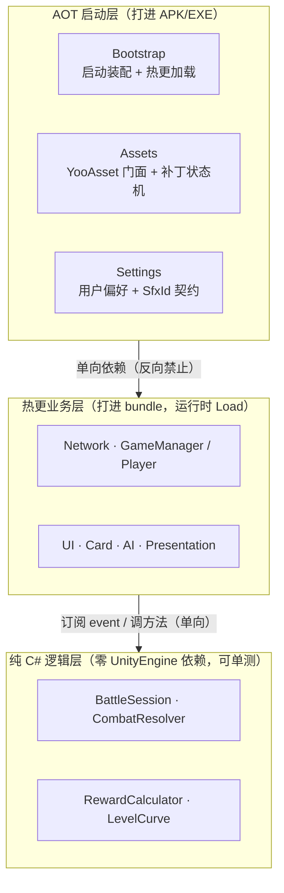

## 项目概览

**烛札（Candle & Cards）** 是一款基于 **Unity 6** 的双人回合制对战卡牌游戏：剑 / 盾 / 弓 / 药水四种卡牌互相克制（剪刀石头布式），支持**局域网联机**与**三档 AI 对战**，目标平台 Windows + Android。

它不是又一个卡牌 Demo——真正下功夫的地方在工程：战斗规则、奖励公式、升级曲线全部下沉成**零 `UnityEngine` 依赖的纯 C# 类**，可脱离引擎跑单元测试；代码与资源走 **HybridCLR + YooAsset 双热更**；联机走**服务端权威 + 确定性重演**，从结构上杜绝客户端篡改。

| 指标 | 内容 |
|------|------|
| 类型 | 2D 双人回合制对战卡牌（剪刀石头布式克制） |
| 规模 | **~9,651 行 C# / 74 个脚本 / 12 个模块** |
| 网络 | Netcode for GameObjects 2.9.1 · Host + Client · 服务端权威 |
| 热更 | HybridCLR 代码热更 + YooAsset 资源热更（双链路） |
| AI | 三档难度（随机 / 克制贪心 / 期望胜率最大化） |
| 平台 | Windows + Android，鼠标 / 触屏统一适配 |

::link{url="https://candles.micostar.cc" title="烛札 · 试玩下载（Windows / Android）" description="体验包下载。单人模式直接开玩；多人对战需局域网or内网穿透联机。"}

## 核心能力

| 能力 | 一句话说明 |
|------|----------|
| 跨平台统一输入 | 每帧轮询指针状态机，一套代码同时吃鼠标 + 触屏，抬手即清 hover，消除触屏"残留高亮" |
| 事件分类解耦 | 设置按域拆成 5 类事件，UI 只订自己关心的；`OnDestroy` 成对取消，门闩防重复订阅 |
| SO 配置驱动 | 音效→混音总线走 `ScriptableObject` 查表，运行态只读不写资产，加音效零代码改动 |
| 抽象基类模板 | 抽屉面板的滑入/滑出 + 同帧去重沉到基类，子类只写"打开刷新数据"这类业务钩子 |
| 后台线程 + 无锁队列 | UDP 网络 I/O 全部后台 `async`，主线程 `ConcurrentQueue` 无锁出队，绝不阻塞帧率 |
| 头像分片传输 | 超 MTU 的头像拆成 <1472B 分片单播再按序重组，编解码是纯 C# 可单测 |
| 引用计数释放 | 预加载资源计数缓存，降至 0 才真正 `Release`，分层释放防 bundle 泄漏 |
| IL2CPP 防裁剪 | `link.xml` 精准 `preserve`，按真机 ClassID 报错定位模块，不全局禁裁剪撑大包体 |
| Native JNI 隔离 | 多播锁用引用计数、选图用 `static event`，业务层只见 `string path`，看不到 JNI |
| 场景 NetworkObject | 关闭 NGO 场景管理后用 `PrefabHandler` 精确接管在场对象的同步与销毁 |

## 整体架构

项目维持两条正交的分层边界。**纵向**是运行边界：`MonoBehaviour` 只做动画 / Transform / 输入这类 Unity 边界，业务逻辑下沉到纯 C# 层，两者用 `event` 单向解耦。**横向**是热更边界：AOT 层（打进安装包）与热更层（打进 bundle 运行时 Load）单向依赖，任何被两侧共用的契约（如 `SfxId` 枚举）都下沉到 AOT 层，避免热更反向依赖成环。



> 箭头只能向下：纯逻辑层永不持有 `GameObject` / `Transform`；热更层永不被 AOT 层反向引用。

## 关键设计一 · 热更新 / 资源管理 / CDN

**这是项目最花心思的子系统**，由三个互相咬合的部分组成：

**① 双场景 + HybridCLR 代码热更三步。** IL2CPP 下"构建时不存在的类型运行时不能直接用"，所以含热更脚本的 `Main` 场景被移出 Build Settings、改打进 bundle，安装包里只留一个纯 AOT 的 `Launcher` 场景。热更 DLL 加载严格三步走，缺一步真机必崩：

```csharp
// 高明之处：第 1、3 步是新手最容易漏的——漏 ① 泛型在真机炸 ExecutionEngineException；漏 ③ NGO 的
// NetworkVariable 序列化 / RPC 派发表为空（晚加载的 DLL 不会被引擎自动扫描 RuntimeInitializeOnLoad）。
RuntimeApi.LoadMetadataForAOTAssembly(aotBytes, HomologousImageMode.SuperSet); // ① 补 AOT 元数据
var hot = Assembly.Load(hotDllBytes);                                          // ② 注入热更字节码
InvokeRuntimeInits(hot);                                                       // ③ 手动补触发 NGO 注册
```

**② 局域网 CDN 固定目录模型。** 版本信息下沉到 `.version` 文件而非 URL 路径，于是客户端寻址模板**永远不变**，发版只是把构建产物覆盖到固定目录：

```csharp
// 高明之处：URL 不含版本段 → 客户端代码零改动；版本由 YooAsset 读 .version 自动协商；
// bundle 用 hash 命名多版本共存，ClearUnusedBundleFiles 回收旧包，服务器磁盘不膨胀。
string GetRemoteMainURL(string fileName) => $"{_hostServerIP}/CDN/{_platformName}/{fileName}";
```

**③ 纯 C# 补丁状态机 + 引用计数释放。** 补丁流程（初始化→请求版本→更新清单→清缓存→下载）是个不继承 `MonoBehaviour`、不持有任何 UI 引用的纯 C# 状态机，所有进度通过静态事件总线广播，`LoadingScreenUI` 只是个纯订阅方；资源侧则用引用计数缓存，重复预加载只加计数，降至 0 才真正释放。


## 关键设计二 · MB 边界层 + 纯 C# 逻辑层

**原理一句话**：把战斗状态机做成不依赖 Unity 生命周期的普通 C# 类，`MonoBehaviour` 只负责把逻辑事件"翻译"成动画。**高明之处**：状态重置一行 `default` 清零绝不漏字段，且整个类能在 NUnit 里直接 `new` 出来验证所有状态转移，不用启动 Unity 进程。

```csharp
public class BattleSession            // 零 UnityEngine 依赖，可脱离引擎单测
{
    public event Action<CombatOutcome, PendingCardData, PendingCardData> OnCombatResolved;
    public void ResetAll() { _p1Card = default; _p2Card = default; _p1RematchReady = _p2RematchReady = false; }
}
// CombatPresenter（MonoBehaviour）只订阅事件、起协程放动画，不含任何战斗规则
```

克制规则、奖励公式、升级曲线同样是零依赖纯函数，双端用**完全相同的输入**调用，确定性保证结果一致——这也正是下面防作弊的地基。

## 关键设计三 · 服务端权威 + AI 即一个特殊玩家

**原理一句话**：服务端只广播"双方各打了什么牌"，双端各自跑同一个纯函数 `CombatResolver.Resolve` 重演结算；血量这种敏感状态用 `NetworkVariable` 锁死写权限在服务端。**高明之处**：客户端即使改本地 UI 也算不出真实血量，作弊在结构上不可能；而 `NetworkVariable` 还顺带解决了晚加入者的自动同步。

```csharp
public void TakeDamage(int dmg) { if (!IsServer) return; netCurrentHealth.Value -= dmg; } // 写权限锁服务端，自动广播
```

更妙的是 **AI 不写任何 `if(isAI)` 分叉**：真人和 AI 出牌最终都汇聚到同一个 `BattleSession.SubmitCard`，UI / 动画 / 结算一行都不用改。AI 决策在 Host 本地直调（省一次 RTT，也防 Client 伪造）：

```csharp
void IBattleApi.SubmitCard(...)  => SubmitCardServerRpc(...);   // 真人：走 ServerRpc
public void SubmitCardForAI(...) => _session.SubmitCard(...);   // AI：Host 本地直调，两路同一出口
```

局域网房间发现走"UDP 信标广播 + 后台 async 接收 + 主线程无锁出队"；头像因超 MTU 改为按需单播分片再重组。


## 关键设计四 · 三档 AI 决策

**原理一句话**：三档不是简单的"越来越强"，而是一条"新手—进阶—高阶"学习曲线——Lv1 纯随机给新手赢面，Lv2 单层克制 + 跨回合记忆（切换出牌即可反制），Lv3 在均匀概率假设下做**期望胜率最大化**。**高明之处**：Lv3 复用纯函数 `CombatResolver` 求期望，复杂度仅 `O(handSize×4)`、无堆分配、单帧 <1ms，比蒙特卡洛 / 博弈树在"不完全信息 + 同时出牌"模型下既快又更优。

```csharp
// Lv3：枚举每张手牌 × 4 种假想敌（均匀概率）求加权期望收益，argmax 选最优；EvaluateExpectedScore 是无状态纯函数
float avg = EvaluateExpectedScore(myCard.cardType, myCard.powerValue);  // Σ Resolve(enemy, my) / 4
```

难度下拉框还做了**零硬编码绑定**：`Awake` 时反射 `Difficulty` 枚举自动生成选项，加一档 Lv4 只需改枚举 + 一行 `GetLabel`，UI 自动跟随、上界自动 Clamp。


## 制作分享
- UI部分：采取**提示词**--**Stitch**--**Figma** 这一个AI工作流，充分利用AI对于Html成熟编写+NanoBanana、Image2等优质图像模型来配合**Stitch**的Design.md来完成风格统一化的UI制作，最后选择性采取UI-Tookit *or* Figma进一步处理图像素材，分不同状态处理UI素材


## 技术栈

| 类别 | 技术 | 版本 |
|------|------|------|
| 引擎 | Unity | 6000.3.9f1（Unity 6 LTS） |
| 渲染管线 | Universal Render Pipeline (URP) | 17.3 |
| 网络框架 | Netcode for GameObjects | 2.9.1 |
| 传输层 | Unity Transport (UDP) | — |
| 代码热更 | HybridCLR | v8.12.0 |
| 资源热更 | YooAsset | 2.3.19 |
| 动画 | DOTween | 卡牌飞行 / 翻转 / 退场 |
| 手牌布局 | Unity Splines | 2.8.2（弧线排列） |
| 多开调试 | ParrelSync | Host + Client 双实例 |
| 构建目标 | IL2CPP | Windows x64 / Android ARM64 |

## 试玩与下载

当前版本 **v1.1.0 Beta**（by MicoStar）。单人模式可直接体验三档 AI；多人对战需要在局域网内or内网穿透后联机。

::link{url="https://candles.micostar.cc" title="烛札 · 试玩下载（Windows / Android）" description="体验包下载。单人模式直接开玩；多人对战需局域网or内网穿透联机。"}

## 延伸阅读

::link{url="/works/mr-lbe-vr-shooter/" title="多人 VR/MR 射击 · MR_LBE" description="同样基于 Netcode for GameObjects 的多人项目：本地立即开火 + 网络只同步表现、本地假体 / 网络真体，让 VR 低延迟手感与多人状态一致共存。"}

::link{url="/works/smart-campus-digital-twin/" title="Unity 智慧校园数字孪生系统" description="另一套 Unity 客户端架构模板：Cinemachine 双状态相机、ScriptableObject 数据驱动导航、事件解耦与自定义编辑器工具。"}
