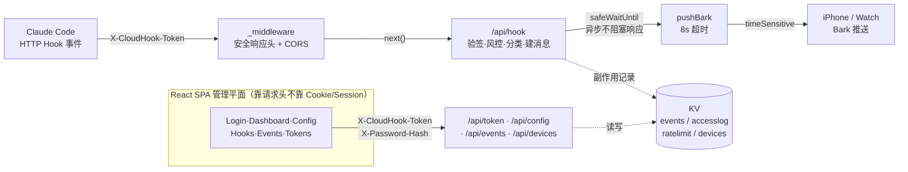

## 项目概览

**CloudHook** 是一套跑在 **EdgeOne Pages 边缘函数**上的 Claude Code 云端监控通知系统：Claude Code 在关键节点（请求权限、发出通知、任务完成）触发 HTTP Hook，边缘函数验签、分类、风控后，经 **Bark** 把提醒推到 iPhone / Apple Watch。它解决的是「让 AI Coding Agent 跑长任务时人能安心离开屏幕」这件事——权限请求即时触达，task done 顺带报平安。

整套系统单用户、零成本、无服务器账单：边缘函数全球就近接入、零冷启动，KV 按量付费在私有用量下几乎为零。核心设计有四块——无状态 HMAC Token 认证、端到端凭证加密、智能推送管线、边缘风控四件套，全部跑在 EdgeOne 边缘运行时上。

| 指标 | 内容 |
|------|------|
| 类型 | Claude Code 云端监控通知系统（边缘函数 + SPA 管理后台） |
| 规模 | **~706 行核心 `_shared.js` / 8 个 API 端点 / 6 个前端页面** |
| 运行时 | EdgeOne Pages Functions（边缘 Worker，全球就近接入） |
| 存储 | EdgeOne KV（事件 / 访问日志 / 设备 / 速率计数，滚动窗口） |
| 认证 | 无状态 HMAC-SHA256 Token 自验证 + KV 吊销名单 |
| 通知 | Bark（`level: timeSensitive` 穿透专注模式，8 秒超时） |

::link{url="https://github.com/Besty0728/cloudhook" title="CloudHook · GitHub" description="MIT 开源。基于 EdgeOne Pages 边缘函数 + KV 的 Claude Code 云端监控通知系统，单用户零成本部署。"}

## 核心能力

| 能力 | 一句话说明 |
|------|----------|
| 无状态验签 | Token 用 HMAC-SHA256 自签名，验签零 DB / KV 查询，只在吊销时才碰 KV |
| 选择性吊销名单 | 不存「有效 Token」全表，只存 `revoked_{jti}`，键带 TTL=Token 剩余生命，过期自动清理 |
| AES-GCM 随机 IV | Bark Key 加密每次独立 12 字节 IV，密钥规整 32 字节，相同明文也产出不同密文 |
| 凭证脱敏 | Bark Key 回前端只露 `xxxx****xxxx`，加密态入库、明文从不落盘 |
| 密码预哈希 | 前端 SHA-256 先哈希再出门，明文不出浏览器；服务端恒定时间比较防计时侧信道 |
| Bash 分级 | sudo / `rm -rf` = critical，`rm` / `curl|sh` / `git push --force` = high，未知命令默认 medium 保守 |
| 推送力度可调 | 默认 `timeSensitive` 穿透专注模式；`config.notifier.level` 可整体下调，测试推送走 `active` 免打扰 |
| WAF 绕过 | EdgeOne WAF 静态扫描拦截 `PermissionRequest` 字面量，用 `String.fromCharCode` 运行时拼装绕过 |
| 风控四件套 | IP 三态（off/allowlist/blocklist）+ 地理直读 `request.eo.geo` + 分钟级速率限制 + 安全响应头全套 |
| 滚动窗口日志 | 事件 cap 100、访问日志 cap 200、设备 cap 50，`unshift` 后 `length=CAP` 的 O(1) 截断，非 splice |

## 整体架构与数据流

项目维持两条边界分明的平面。**数据平面**是热路径：Claude Code 触发 Hook → `_middleware` 套安全响应头 → `/api/hook` 验签 + 风控 + 分类 → Bark 推到手机，全程无状态，KV 只在记录副作用时被碰一下（且放进 `safeWaitUntil` 异步执行，绝不阻塞响应）。**管理平面**是冷路径：React SPA 调 `/api/token` `/api/config` 等读写 KV，鉴权全靠请求头（`X-CloudHook-Token` + `X-Password-Hash`），不依赖 Cookie / Session。



> 实线是请求 / 推送的同步链路，虚线是 KV 的异步副作用。

## 手机端收信展示


## 关键设计一 · 无状态 HMAC Token 认证

Token = `base64url(payload).hmac签名`，边缘函数收到请求后用 `HMAC_SECRET` 本地算一遍签名比对，不查 KV。有效 Token 从不入库，只在要踢掉某台设备时往 KV 写一条 `revoked_{jti}` 吊销键，键带 TTL = Token 剩余生命周期，过期自动消失。`exp===0` 表永久，`exp` 缺省直接判无效。

`userId` 在整个系统里固定为 `default`（KV 键形如 `user_default_config`）——刻意的单用户设计，私有部署一台人一套配置。

```js
// /api/hook 入口：先验签，再查吊销名单
const token = request.headers.get('X-CloudHook-Token');
const payload = await verifyAuthToken(token, env.HMAC_SECRET, { full: true });
if (!payload) return jsonResponse({ success: false, error: 'Invalid token' });

// 只在吊销时碰 KV：revoked_{jti} 带 TTL=剩余生命周期，过期自动清
if (await isTokenRevoked(kv, payload.jti)) {
  return jsonResponse({ success: false, error: 'Token revoked' });
}
```


## 关键设计二 · 端到端凭证安全

密码在前端 SHA-256 预哈希再出门，线路上永远不传明文；服务端比对走恒定时间比较（逐字节 XOR 累积、最后才判等），防计时侧信道。Bark Key 用 AES-256-GCM 加密入库，每次独立随机 12 字节 IV（同一把 Key 加密多次密文也各不相同）；回前端一律脱敏成 `xxxx****xxxx`，明文只在解密瞬间于内存存在、从不落盘。

```js
// AES-256-GCM 加密 Bark Key，每次独立 12 字节随机 IV
const iv = crypto.getRandomValues(new Uint8Array(12));
const encrypted = await crypto.subtle.encrypt({ name: 'AES-GCM', iv }, key, data);

// 回前端脱敏，只露前后各 4 位
function maskBarkKey(k) {
  return k.length < 8 ? '***' : k.slice(0, 4) + '****' + k.slice(-4);
}
```


## 关键设计三 · 智能推送管线

这是 EdgeOne 边缘函数的核心入口。`/api/hook` 收到 Claude Code 的事件后，依次走「验签 → 风控 → 解析 → 分类 → 建消息 → 异步推送」的流程，最后统一返回 HTTP 200（用 `body.success` 表达结果——EdgeOne 对 5xx 会用 HTML 错误页覆盖 JSON，诊断信息会丢）。推送和写日志都放进 `safeWaitUntil` 异步执行，绝不阻塞响应。

```js
// EdgeOne 边缘函数 /api/hook 入口
export async function onRequestPost(context) {
  const { request, env } = context;
  const token = request.headers.get('X-CloudHook-Token');
  const payload = await verifyAuthToken(token, env.HMAC_SECRET, { full: true });

  // 风控（IP / 地理 / 速率）→ 解析 → 分类
  const parsed = parseEvent(await request.json(), eventName);
  const eventType = localClassify(parsed);   // permission_required / attention_required / task_done

  // 异步推送 + 写日志，不阻塞响应
  safeWaitUntil(context, (async () => {
    await pushBark(barkKey, config.bark_server, message.title, message.body,
                   { level: 'timeSensitive' });
    await logEvent(kv, userId, { event_type: eventType, risk_level: getRiskLevel(...) });
  })());

  return jsonResponse({ success: true, event_type: eventType });   // 统一 200
}
```

事件分类与风险评级在 `_shared.js` 里：`PermissionRequest` 直接归 `permission_required`；`Notification` 命中 13 个英文 + 10 个中文权限关键词才升级，否则算 `attention_required`；`Stop` 归 `task_done`。Bash 命令按 `sudo` / `rm -rf` = critical、`rm` / `curl|sh` / `git push --force` = high、`cp` / `git commit` = medium、`ls` / `cat` = low 分级，未知命令默认 medium 保守。注意 `PermissionRequest` 这个事件名会被 EdgeOne WAF 当成攻击特征拦掉（返回 545），源码用 `String.fromCharCode` 运行时拼出这个字符串绕过静态扫描。


## 关键设计四 · 边缘风控四件套

边缘函数入口做 IP / 地理 / 速率 / 安全响应头四道闸。IP 三态配置驱动（off / allowlist / blocklist）；地理信息直接读 EdgeOne 边缘节点解析好的 `request.eo.geo`，零额外 HTTP 调用；速率限制键带 `expirationTtl: 120`，过期自动回收；安全响应头由 `_middleware` 统一注入，无需每个端点重复。注意这套头不含 CSP——边缘函数层只产 JSON API，没有 HTML 文档面。

```js
// _middleware.js：EdgeOne 全局中间件，统一注入安全头
export async function onRequest(context) {
  const { request, next } = context;
  const response = await next();
  return applySecurityHeaders(response);   // X-Frame-Options:DENY / Referrer-Policy / Permissions-Policy …
}

// /api/hook 里的三道风控闸
checkIpAccess(riskControl.ip, clientIp);          // IP 三态：off/allowlist/blocklist
checkGeoRestriction(riskControl.geo, request);    // 直读 request.eo.geo，零额外调用
await checkRateLimit(kv, userId, 'hook', 100);    // KV 键带 TTL=120s，过期自动回收
```


## 前端管理界面

前端是 **React 19 + Vite 8 + React Router 7** 的 SPA，跑在 EdgeOne Pages 静态托管上，所有写操作靠请求头带 Token 与密码哈希鉴权，不依赖 Cookie / Session。六个页面各司一职：

- **Login** — 输入 master password，前端 SHA-256 预哈希后 POST `/api/token` 换取无状态 Token；设备指纹去重，同设备复用既有 `jti` 续期而非堆积重复记录。
- **Dashboard** — 监控全景：统计卡 + 事件列表带风险徽章，一眼看清最近发生了什么。
- **ConfigPage** — 两个 Section：「Bark 通知」管 Key（脱敏展示 + 测试推送），「风险控制」管 IP / 地理 / 速率四件套。
- **HooksPage** — 引导接 Claude Code：端点 URL + Token + `settings.json` 代码块 + 一键复制 + 链路图。
- **EventsPage** — 双 Tab：事件流（列表 + 风险徽章 + 类型筛选 + 详情弹窗）与访问日志（IP / 地理 / 设备 + 批量删除）。
- **TokensPage** — 设备卡片 + 当前设备高亮 + 手风琴揭示 Token + 创建 / 改有效期 / 撤销。


## 技术栈

| 类别 | 技术 | 版本 |
|------|------|------|
| 边缘运行时 | EdgeOne Pages Functions | 边缘 Worker，全球就近接入 |
| 存储 | EdgeOne KV | 事件 / 访问日志 / 设备 / 速率计数 |
| 前端框架 | React | 19 |
| 构建工具 | Vite | 8 |
| 路由 | React Router | 7 |
| 状态管理 | Zustand | — |
| 样式 | Tailwind CSS | — |
| HTTP 客户端 | Axios | — |
| 图标 / 动画 | lucide-react + framer-motion | — |
| 推送 | Bark | `level: timeSensitive` 穿透专注模式 |
| 部署 | edgeone.json | Pages Functions + 静态托管 |

## 开源与部署

CloudHook **MIT 开源**，部署走 EdgeOne Pages 标准流程：`edgeone.json` 声明 Functions 与静态托管，前端 `build` 产物输出到 `public/`，边缘函数在 `edge-functions/` 下按文件路径自动路由（`api/hook.js` → `/api/hook`）。环境变量三件套即可跑通：`HMAC_SECRET`（Token 签名密钥）、`MASTER_PASSWORD_HASH` 或 `MASTER_PASSWORD`（登录密码，前者预哈希更安全）、`ENCRYPTION_KEY`（Bark Key 加密密钥）。本地开发可用 `dev-mock` 模式免联 EdgeOne 调试前端。整个系统单用户、零成本——KV 按量付费在私有用量下几乎为零，边缘函数调用同样在免费额度内。

::link{url="https://github.com/Besty0728/cloudhook" title="CloudHook · GitHub" description="MIT 开源。基于 EdgeOne Pages 边缘函数 + KV 的 Claude Code 云端监控通知系统，单用户零成本部署。"}

## 延伸阅读

::link{url="/works/unity-skills/" title="Unity Skills · AI Coding Agent 工具链" description="同为 AI Coding Agent 服务的基础设施：把 Claude Code 的能力沉淀成可复用 Skill，与 CloudHook 的「让 Agent 跑长任务时人能离开」一正一反，主题呼应。"}

::link{url="/works/candles/" title="烛札 · 双人对战卡牌" description="另一个把安全下沉到结构的工程：服务端权威 + 确定性重演从结构上防作弊，与 CloudHook 的「签名即信任 + 选择性吊销」同样是用结构而非检查保证安全，哲学呼应。"}
