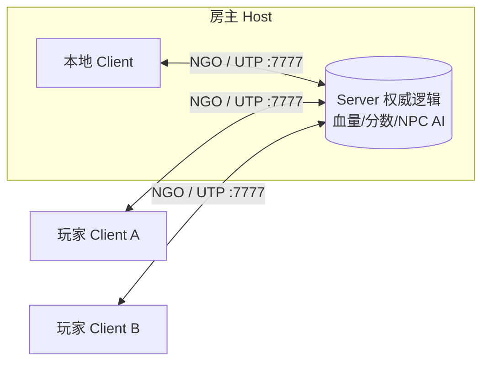
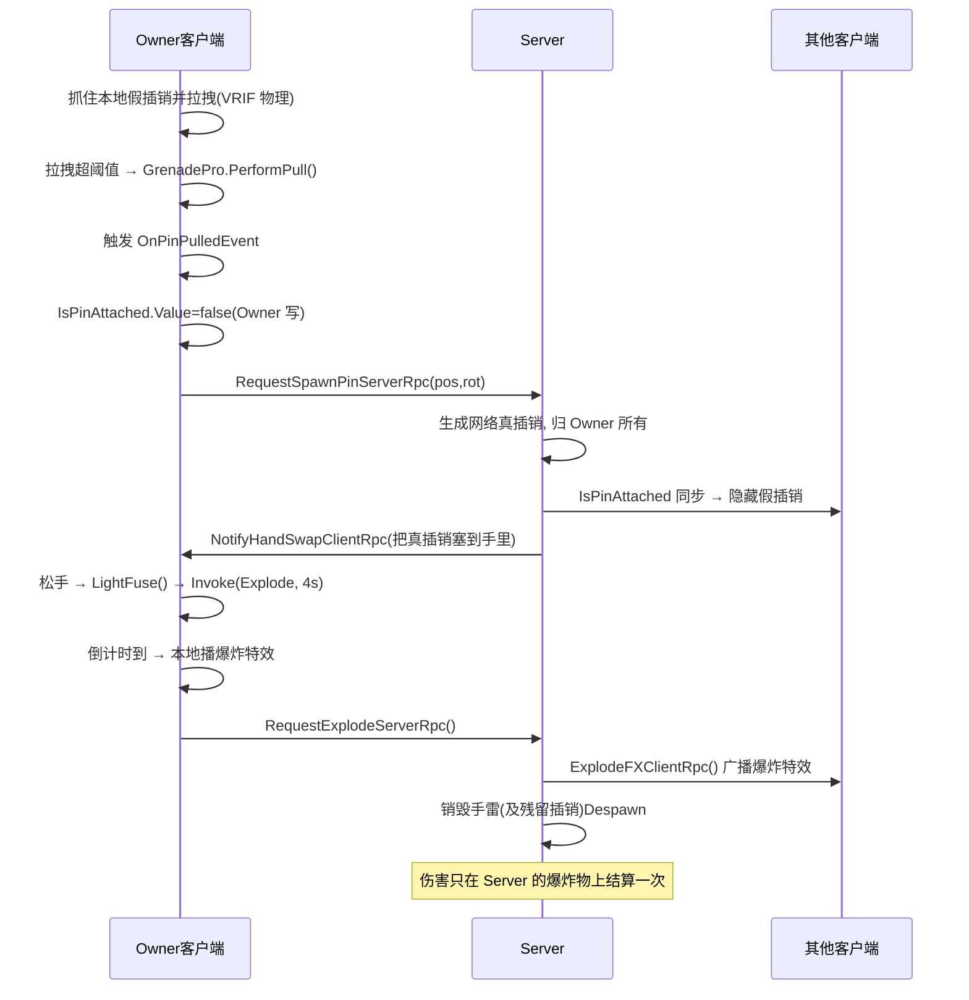
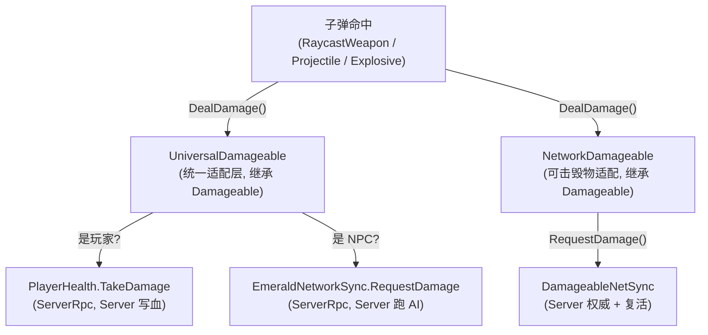

## 项目概览

<!-- 建议在此放图:游戏实机画面，玩家佩戴 PICO 头显在大空间战场内协同射击的俯视全景图 -->

面向 **PICO 企业级头显**的线下大空间（LBE）**多人 VR/MR 射击游戏**：多名玩家同处一个物理空间，在共享虚拟战场中协同射击 AI 驱动的 NPC 敌人。

项目的真正难点在于「多人」与「VR」的矛盾叠加：VR 要求手部交互在 50ms 以内响应，任何可感延迟都会破坏沉浸感甚至引发晕动症；而多人网络天然带来延迟与竞争，血量、计分、伤害必须有唯一权威端裁决。**本项目的所有架构决策，都是在回应这对矛盾**。

运行时采用 **NGO Host-Client 拓扑**：房主既是 Server 又是本地 Client，其他玩家为纯 Client，通过 UDP 端口 7777 连接。

<details>
<summary>Host-Client 拓扑结构</summary>



</details>

## 为什么要做

现有 VR 多人射击项目通常在两个极端之间取舍：要么**全部服务器权威**（VR 手感被网络延迟毁掉，输入到反馈有明显滞后），要么**全部本地权威**（失去防作弊能力，各端状态随时分叉）。

本项目验证的核心命题是：**延迟敏感的数据和规则敏感的数据，可以也应该分开用不同的权限模型处理。** 位姿、抓握、枪栓这类高频交互状态交给 Owner 本地决策（零延迟），血量、分数、伤害结算这类规则状态交给 Server 权威裁决（防作弊）。在 VRIF/BNG + Emerald AI 两个纯单机框架的约束下，整套集成全程**零侵入框架源码**，只通过桥接脚本接入网络层。

## 核心能力

| 子系统 | 关键设计 |
|--------|----------|
| **细粒度网络权限** | Owner 写位姿/抓握/枪栓，Server 写血量/分数；`ClientNetworkTransform` 覆盖默认服务器权威，VR 手部零延迟 |
| **枪械交互** | 本地立即开火 + `ServerRpc→ClientRpc` 广播表现；`NetworkMagazine.DeductAmmo()` 全局唯一弹药扣减出口，防双扣 |
| **手雷系统** | 拉拽阶段用本地假销保手感，拔出瞬间 `DoHandSwap` 切入网络真销；爆炸伤害 `IsServer` 闸门防翻倍 |
| **配件装卸** | 两套并存方案：`NetworkSnapZone`（真实网络物体）/ `NetworkAttachmentSwapper`（索引同步假配件），按需选型 |
| **抓取防盗** | `IsHeld` / `IsInBackpack` 双重状态同步，远端直接禁用 Grabbable + Collider，零往返零竞态 |
| **NPC 网络化** | Server 跑完整 Emerald AI，Client 禁用所有决策组件只留 Animator/HealthComponent；位置/动画/血量/特效走四条专用通道 |
| **统一伤害 + 计分** | `UniversalDamageable` 统一适配玩家/NPC/可击毁物三类受击目标；`NetworkList` 服务端权威排行榜，新玩家加入自动全量补发 |

## 技术核心

### 一、细粒度 Owner/Server 权限拆分 + ClientNetworkTransform

<!-- 建议在此放图:权限分层示意图，Owner 写交互状态箭头指向左侧，Server 写结算状态箭头指向右侧 -->

NGO 默认的 `NetworkTransform` 是服务器权威：本地动一下，要先发给服务器，服务器广播回来，玩家看到自己的手有可感延迟，在 VR 中会直接诱发晕动症。

本项目用**一行重写**把 Transform 权威搬回本地：

```csharp
// 来源:ClientNetworkTransform.cs
public class ClientNetworkTransform : NetworkTransform
{
    protected override bool OnIsServerAuthoritative() => false; // 改为客户端权威
}
```

位姿本就不是作弊敏感数据，这个取舍极为划算。同时，玩家头部 + 双手姿态通过 `NetworkVariable<PoseData>` 以 Owner 写权限广播给全部端：

```csharp
// 来源:PlayerAvatar.cs
public NetworkVariable<PoseData> Pose = new NetworkVariable<PoseData>(
    default, NetworkVariableReadPermission.Everyone,
    NetworkVariableWritePermission.Owner);
```

<details>
<summary>Owner vs Server 权限分层总表</summary>

| 权威端 | 负责的数据 | 理由 |
|--------|-----------|------|
| **Owner 写** | 位姿、抓握 IsHeld、背包 IsInBackpack、枪栓、弹匣位置/旋转 | 高频交互状态，必须本地零延迟 |
| **Server 写** | 血量、分数、名牌显示、NPC 状态 | 结算状态，需唯一权威端防作弊 |

**权限写反 = 静默失败**：NGO 向没有写权限的 `NetworkVariable` 写入不报错，只是不生效。这是本项目在开发中最难排查的问题之一。

</details>

### 二、本地假体·网络真体范式

VR 强交互（换弹、拔销）的核心矛盾：**需要跟手的阶段是延迟敏感的，需要全网可见的阶段是一致性敏感的**。两者不能同时由同一个对象满足。

**换弹 Bait-and-Switch**：换弹时 VRIF 要求弹匣是其管理的子对象，但 NGO 不允许改变网络物体的父子级。解法是让玩家实际操作一个**本地假弹匣**，`NetworkMagazineSwapper` 在检测到假弹匣进入卡槽区域时，Server 生成网络真弹匣完成换弹，对玩家完全透明。弹药扣减全局只有一个出口：

```csharp
// 来源:NetworkMagazine.cs
public void DeductAmmo() {
    if (IsServer) { NetAmmo.Value--; }
    else { RequestDeductServerRpc(); }
}
```

**手雷假销/真销 DoHandSwap**：拉拽阶段操作的是零延迟的**本地假插销**；在拔出的那一刻，Server 生成网络真插销，`DoHandSwap` 把玩家的手从假销切换到真销，后续飞出、落地、回插全走网络：

```csharp
// 来源:NetworkGrenadePinSwapper.cs
private IEnumerator DoHandSwap(NetworkObject newPin) {
    if (_grenadePro.LocalSafetyPin && _grenadePro.LocalSafetyPin.BeingHeld) {
        var hand = _grenadePro.LocalSafetyPin.GetPrimaryGrabber();
        hand.TryRelease();
        _grenadePro.LocalSafetyPin.gameObject.SetActive(false);
        yield return null;
        hand.GrabGrabbable(newPin.GetComponent<Grabbable>());
    }
}
```

<!-- 建议在此放图:手雷拔销时序图截图，展示假销→真销切换时刻 -->

<details>
<summary>手雷完整时序图</summary>



</details>

### 三、UniversalDamageable 统一伤害适配 + 爆炸防翻倍

<!-- 建议在此放图:伤害数据流示意，子弹→UniversalDamageable→三条分叉路径（玩家/NPC/可击毁物）→Server 裁决 -->

玩家、NPC、可击毁物体三类受击目标的底层接口完全不同，但所有子弹/爆炸命中走**同一个适配层入口**：



爆炸（手雷/油桶）在每个客户端都会播放，如果伤害跟着表现走则会翻 N 倍（N 为玩家数）。解法是前置一道 `IsServer` 闸门：

```csharp
// 来源:NetworkDamageable.cs
if (sender != null && sender.GetComponent<BNG.Explosive>() != null)
{
    if (NetworkManager.Singleton != null && !NetworkManager.Singleton.IsServer)
    {
        return;   // 非服务端的爆炸伤害，直接丢弃
    }
}
```

可击毁物体复活时，`DamageableNetSync.ProcessRespawn()` 显式重置全部状态并用 kinematic 冻结一帧避免残留力：

```csharp
// 来源:DamageableNetSync.cs
private void ProcessRespawn()
{
    _visualAdapter.Health = _initialHealth;
    NetHealth.Value = _initialHealth; IsDead.Value = false;
    transform.position = _initialPos;
    transform.rotation = _initialRot;
    var rb = GetComponent<Rigidbody>();
    if (rb != null) {
        rb.velocity = Vector3.zero; rb.angularVelocity = Vector3.zero;
        rb.isKinematic = true;
        StartCoroutine(RestoreRigidbodyAfterDelay(rb, false, 0.5f));
    }
    OnRespawnClientRpc();
}
```

<details>
<summary>NPC 网络化：Server 大脑 + Client 提线木偶</summary>

Emerald AI 是纯单机框架。本项目**不改一行源码**，通过 `EmeraldNetworkSync` 在外层切割：

- **Server**：跑完整 AI（感知/寻路/战斗/决策），事件回调把结果写入 NetworkVariable
- **Client**：`OnNetworkSpawn` 时禁用全部 AI 组件（关键：不能只禁主脚本，Animation Event 会绕过 `enabled` 直接调用子组件方法导致空引用崩溃，必须逐个显式禁用）

四类数据走四条专用通道：位置 → `NetworkTransform`，动画 → `NetworkAnimator`，血量 → `NetHealth`（Server 写 NetworkVariable），特效 → `ClientRpc` 广播。

伤害收敛路径：客户端子弹命中 → `UniversalDamageable.DealDamage()` → `EmeraldNetworkSync.RequestDamage()` → `SubmitDamageServerRpc` → Server 调用真实 `_emeraldHealth.Damage()` → 死亡时 `TriggerDeathClientRpc()` 通知所有客户端手动"演出"布娃娃死亡表现。

</details>

## 架构说明

| 层级 | 技术 | 版本 |
|------|------|------|
| 引擎 | Unity | 2022 LTS |
| 渲染管线 | Universal Render Pipeline (URP) | 14.0.12 |
| 网络框架 | Netcode for GameObjects (NGO) | 1.12.2 |
| 传输层 | Unity Transport (UDP) | 端口 7777 |
| VR 运行时 | PICO XR SDK + OpenXR | OpenXR 1.14.3 |
| 大空间安全边界 | PICO 企业级 SDK | Guardian / 大空间 |
| VR 交互框架 | VRIF / BNG | 抓取、武器、背包（零侵入桥接） |
| NPC AI | Emerald AI | Server/Client 切割（零侵入桥接） |
| 输入系统 | Input System | 1.14.0 |
| 手部追踪 | XR Hands | 1.4.3 |
| 导航网格 | AI Navigation (NavMesh) | 1.1.7 |
| 构建目标 | Android (IL2CPP + ARM64) | PICO 企业级头显 |

**场景分层**：`Start.unity`（index 0，大厅/连接）→ 网络场景切换 → `Space.unity`（index 1，战斗主场景）；`UI.unity` 以 Additive + DontDestroyOnLoad 方式持久叠加，UI 引用集中到 `UISceneManager` 单例，彻底消灭 `FindObjectOfType`。

## 使用限制

- 需 PICO 企业级头显（非消费级 PICO 4），依赖 PICO Enterprise SDK 的 Guardian/大空间 API
- Host-Client 拓扑下房主（Host）断线即全场断连，不支持无缝 Host 迁移
- NPC AI 运算全部在 Server（房主机器）执行，大量 NPC 时对房主 CPU 有明显压力
- VRIF/BNG 与 Emerald AI 均以本地路径方式引用，迁移工程时需重建包路径
- 大空间 Guardian 配置依赖 PICO 设备管理平台，需配合企业级部署环境

## 延伸阅读

::link{url="/works/pico-mr-spatial-anchor/" title="PICO-MR 共享空间锚点同步" description="同为 PICO 平台的多人 MR 项目：多台头显通过共享空间锚点把各自坐标系对齐到同一真实物理空间，实现精确重叠的虚实交互。"}
