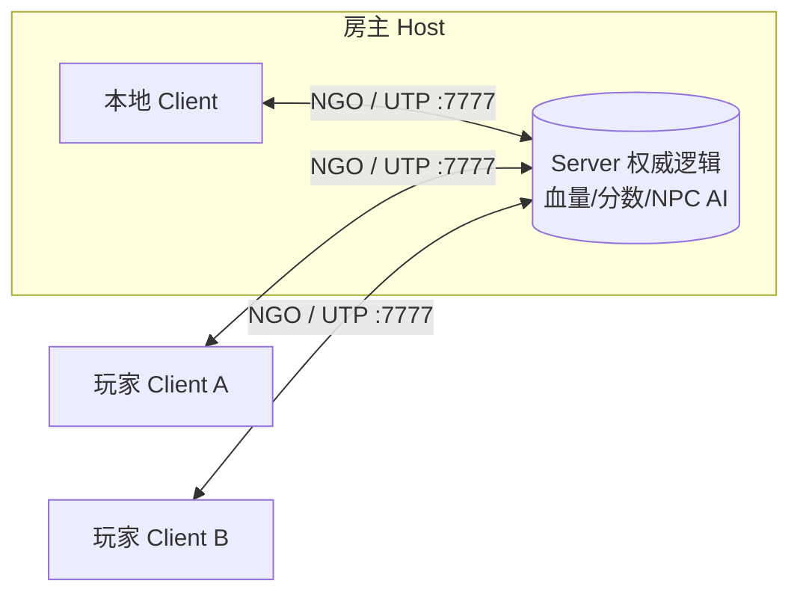

<!-- 建议在此放图:游戏实机画面，玩家佩戴 PICO 头显在大空间战场内协同射击的俯视全景图 -->

## 项目概览

面向 **PICO 企业级头显**的线下大空间（LBE）**多人 VR/MR 射击游戏**：多名玩家同处一个物理空间，在共享虚拟战场中协同射击 AI 驱动的 NPC 敌人。项目最核心、也最下功夫的，是**拟真枪械交互在多人网络下既跟手又一致**。

难点在于「多人」与「VR」的矛盾叠加：VR 要求手部交互近乎零延迟，任何可感延迟都会破坏沉浸感甚至引发晕动症；而多人网络天然带来延迟与竞争，血量、计分、伤害必须有唯一权威端裁决。整套架构都是在回应这对矛盾。

运行时采用 **NGO Host-Client 拓扑**：房主既是 Server 又是本地 Client，其他玩家为纯 Client，通过 UDP 端口 7777 连接。



## 为什么要做

现有 VR 多人射击常在两个极端之间取舍：要么全部服务器权威（VR 手感被网络延迟毁掉），要么全部本地权威（失去防作弊、状态随时分叉）。

本项目验证的核心命题是：**延迟敏感的数据和规则敏感的数据，应该分开用不同的权限模型处理。** 位姿、抓握、枪栓这类高频交互状态交给 Owner 本地决策（零延迟），血量、分数、伤害结算交给 Server 权威裁决（防作弊）。同时，VRIF/BNG 与 Emerald AI 两个纯单机框架全程零侵入源码，只通过桥接脚本接入网络层。

## 枪械交互：本地手感 × 网络一致（核心）

一把枪从抓取、上膛、开火到换弹，每个动作既要在自己手里**零延迟跟手**，又要让其他玩家**看到一致的状态**。做法是把「延迟敏感」与「一致性敏感」拆开：

- **本地立即开火**：扣扳机时本地立即开火、出枪口火光与后坐力（沿用 VRIF 原生手感），再通过 `ServerRpc → ClientRpc` 把音效、弹道、火光等**表现层**广播给其他玩家——开火者零延迟，其他人看到一致表现。
- **状态网络一致**：弹药、弹匣、配件、上膛状态全网同步；弹药扣减全局只有服务端一个出口，无论开火指令从哪台机器发起都不会双扣。
- **零侵入桥接**：物理抓取、双手上膛、装卸瞄具握把等都沿用 VRIF/BNG，不改框架源码，只在外层用桥接脚本接入网络。

### 本地假体 · 网络真体（"假身"）

VR 强交互最棘手的矛盾：**需要跟手的阶段是延迟敏感的，需要全网可见的阶段是一致性敏感的，两者不能由同一个对象同时满足。** 解法是让玩家实际操作一个**本地假体（"假身"）**，在关键时刻无缝切换成网络真体：

- **换弹**：玩家手里抓的是一个**本地假弹匣**，零延迟跟手；当它进入卡槽区域的瞬间，服务端生成**网络真弹匣**完成换弹，整个切换对玩家完全透明。
- **手雷拔销**：拉拽阶段操作的是**本地假插销**保手感；在拔出的那一刻，服务端生成**网络真插销**，把玩家的手从假销「换手」到真销，后续飞出、落地、回插全走网络。

这套「假身」范式的地基，是把手部位姿的权威从服务器搬回本地——位姿本就不是作弊敏感数据，这个取舍极为划算：

```csharp
public class ClientNetworkTransform : NetworkTransform
{
    protected override bool OnIsServerAuthoritative() => false; // 改为客户端权威
}
```

## 其它核心能力

| 子系统 | 一句话说明 |
|--------|----------|
| **NPC 网络化** | 服务端跑完整 Emerald AI，客户端只做表现，把纯单机 AI 改造成多人一致的网络 NPC |
| **统一伤害 + 计分** | 玩家/NPC/可击毁物三类目标统一受击入口；服务端权威排行榜，新玩家加入自动补发历史分 |
| **手雷爆炸防翻倍** | 爆炸表现人人可放，但伤害结算只认服务端，杜绝 N 个客户端各算一次的翻倍 |
| **UI 独立场景** | UI 抽成独立场景 Additive 叠加 + 持久化，单例集中引用，与玩法彻底解耦 |

## 技术栈

| 层级 | 技术 | 版本 |
|------|------|------|
| 引擎 | Unity | 2022 LTS |
| 渲染管线 | Universal Render Pipeline (URP) | 14.0.12 |
| 网络框架 | Netcode for GameObjects (NGO) | 1.12.2 |
| 传输层 | Unity Transport (UDP) | 端口 7777 |
| VR 运行时 | PICO XR SDK + OpenXR | OpenXR 1.14.3 |
| 大空间安全边界 | PICO 企业级 SDK | Guardian / 大空间 |
| VR 交互框架 | VRIF / BNG | 零侵入桥接 |
| NPC AI | Emerald AI | Server/Client 切割 |
| 构建目标 | Android (IL2CPP + ARM64) | PICO 企业级头显 |

**场景分层**：`Start.unity`（大厅/连接）→ 网络场景切换 → `Space.unity`（战斗主场景）；`UI.unity` 以 Additive + DontDestroyOnLoad 持久叠加，UI 引用集中到 `UISceneManager` 单例。

## 使用限制

- 需 PICO 企业级头显（非消费级 PICO 4），依赖 PICO Enterprise SDK 的 Guardian/大空间 API
- Host-Client 拓扑下房主断线即全场断连，不支持无缝 Host 迁移
- NPC AI 运算全部在房主机器执行，大量 NPC 时对房主 CPU 有明显压力
- VRIF/BNG 与 Emerald AI 均以本地路径引用，迁移工程时需重建包路径

## 延伸阅读

::link{url="/works/pico-mr-spatial-anchor/" title="PICO-MR 共享空间锚点同步" description="同为 PICO 平台的多人 MR 项目：多台头显通过共享空间锚点把各自坐标系对齐到同一真实物理空间，实现精确重叠的虚实交互。"}
