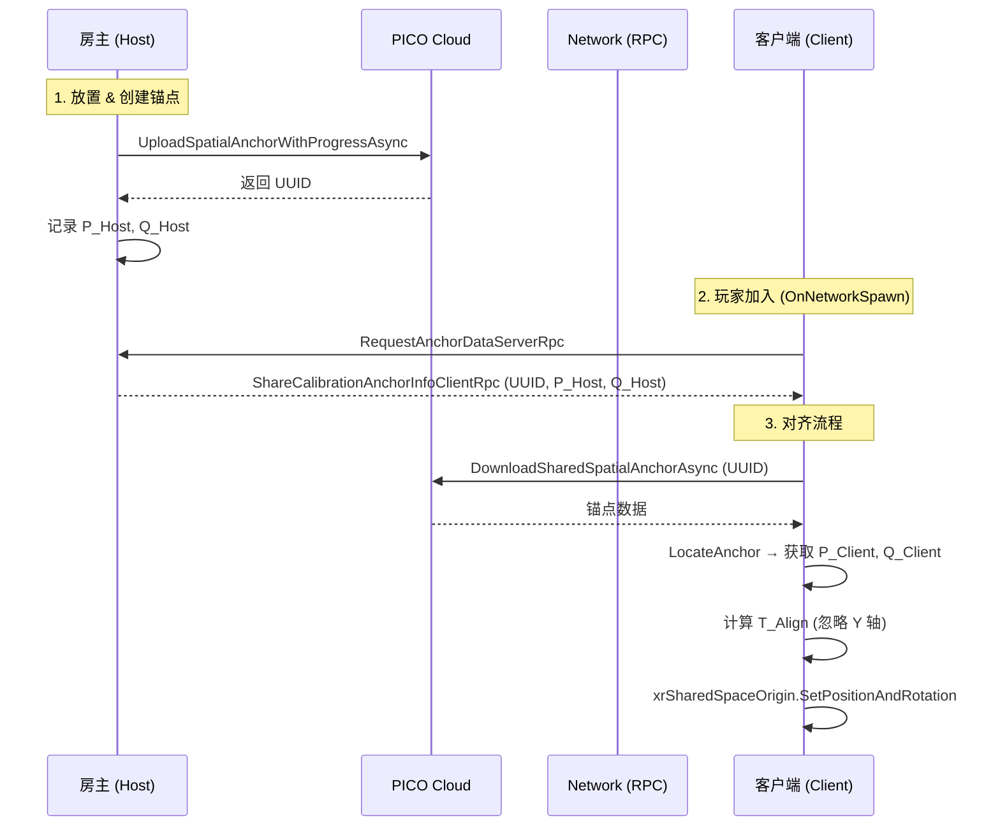

## 项目概览

在 PICO 4 Ultra 头显上运行的**多人混合现实联机 Demo**：多台设备通过 PICO 共享空间锚点把各自的 XR 坐标系对齐到同一真实物理空间，玩家能在同一个真实房间里看到精确重叠的虚拟内容，并实时交互。

这是一个把「多人 MR 坐标系统一」这个底层难题做成完整工程解的项目：从锚点放置、云端上传、跨设备定位，到刚体变换对齐、漂移自愈、地面网格同步，每条链路均有对应的容错与稳定性保障。

## 为什么要做

VR/MR 头显开机时会以当前位置为原点建立一套独立坐标系。两台头显同处一室，它们的「世界」却各自为政——一方将虚拟桌子放在自己坐标系的 `(1.5, 0, 2.0)`，同步给对方时，对方会在**它自己坐标系**的 `(1.5, 0, 2.0)` 渲染，而那个点对应的物理位置完全不同。结果是：虚拟物体各自漂移，多人共享体验根本无从建立。

本项目的解法是用 **PICO 共享空间锚点**作为所有设备公认的物理参照点：主机在真实空间放置锚点并上传 PICO 云端，客户端下载同一锚点后测量它在自身坐标系中的位姿，再用刚体变换把整个客户端 XR 场景搬正——坐标系统一之后，网络同步的任何虚拟对象都自然落在相同的真实物理位置。

## 核心能力

| 功能 | 说明 |
|------|------|
| 多人联机 | Netcode for GameObjects + UnityTransport UDP，局域网 Host/Client 拓扑，两台及以上 PICO 4 Ultra 实时联机 |
| 共享空间锚点标定 | 主机手柄预览放置 → 创建/持久化/上传 PICO 云端 → ClientRpc 广播 UUID 给所有客户端 |
| 坐标系对齐 | 客户端下载锚点、测量本地位姿，与主机位姿做刚体变换，整体调整 XR Origin，使各端坐标系精确对齐到同一物理基准 |
| 玩家化身同步 | 头部位置 + 双手 Transform 实时镜像，客户端权威 NetworkTransform 广播给所有端 |
| MR 透视（VST） | PICO 4 Ultra 前置摄像头透视，虚拟内容叠加真实环境 |
| 真实地面扫描与同步 | 透视开启后触发地面 Mesh 扫描，主机通过 ClientRpc 把顶点/索引广播给所有客户端，双端地面一致 |
| 漂移自愈 | 订阅 `SpatialAnchorDataUpdated` 事件，SDK 优化锚点位姿时自动重算对齐，持续修正累积漂移 |
| 上传容错重试 | 失败时递增延迟重试（最多 5 次），针对地图数据不足给出「请环顾四周」的可执行引导 |
| 后加入玩家补发 | 中途加入的客户端在 `OnNetworkSpawn` 时主动拉取锚点，无需重启房间 |

## 技术核心：共享空间锚点对齐

多人 MR 的底层机制是「让所有设备在各自坐标系里测量同一个真实物理点，然后求出把各坐标系对齐的刚体变换」。具体流程：

主机在真实空间中放置锚点，上传到 PICO 云端，并记录锚点在自身坐标系中的位置与朝向（$P_{Host}$、$Q_{Host}$）。客户端下载同一锚点，用 `LocateAnchor` 在本地坐标系中测出位姿（$P_{Client}$、$Q_{Client}$）。由于两端测量的是**同一个真实物理点**，必然存在唯一刚体变换 $T_{Align}$ 使两端锚点重合。求出 $T_{Align}$ 后，将其**写入客户端 XR 世界坐标系的根节点** `xrSharedSpaceOrigin`——不逐个移动场景内的物体，而是把整个坐标系搬正；挂在该坐标系下的化身、地面、虚拟对象全部自动落到正确的真实物理位置。


<details>
<summary>核心对齐数学</summary>

对任一旋转四元数提取纯 Yaw：前向向量投影到水平面，抹掉 pitch/roll 后重建。房主与客户端均如此处理，得到 $Q_{H\_Yaw}$ 和 $Q_{C\_Yaw}$。

**旋转差值**（使客户端旋转后与房主重合）：

$$Q_{Align} = Q_{H\_Yaw} \times Q_{C\_Yaw}^{-1}$$

**位置差值**（补偿旋转之后的锚点偏移）：

$$P_{Align} = P_{Host} - (Q_{Align} \times P_{Client})$$

**地面锁定**（丢弃高度测量误差）：

$$P_{Align}.y = 0$$

对应实现：

```csharp
// 旋转差：把客户端锚点朝向"扭"成主机锚点朝向
Quaternion rotAlign = hostRot * Quaternion.Inverse(clientRot);
// 位置差：补偿旋转之后锚点所在位置
Vector3 posAlign = hostPos - rotAlign * clientPos;
// Floor 模式两端 Y 轴已沿重力对齐，丢弃高度测量误差，强制锁地
posAlign.y = 0f;
// 写入客户端坐标系根节点，整个世界一次搬正
xrSharedSpaceOrigin.SetPositionAndRotation(posAlign, rotAlign);
```

</details>

<details>
<summary>yaw-only 锁地与漂移自愈</summary>

**yaw-only 锁地**

两端强制开启 Floor 追踪模式，Y 轴天然沿重力垂直对齐，两套坐标系真正的差异只剩绕世界 Y 轴的水平偏航（yaw）加上水平平移。围绕这一物理事实做了两重加固：

- 旋转只取 yaw：把锚点前向向量投影到水平面，抹掉 pitch/roll，重建纯净 yaw 四元数（`ExtractYaw`），彻底避免 pitch/roll 测量噪声把地平面「掰歪」。
- `posAlign.y` 强制置 0：既然两端都是 Floor 模式，根节点 Y 平移必须为零；直接使用锚点 Y 测量值会把高度误差转嫁成「玩家整体浮空或陷地」，强制锁地从根本上杜绝这一问题。
- 重对齐使用 Slerp/Lerp 平滑插值，漂移修正触发的每次重对齐都渐变而非跳变，画面平稳无突跳感。

**漂移自愈**

PICO SDK 底层在优化锚点位姿时会触发 `PXR_Manager.SpatialAnchorDataUpdated` 事件。项目在 `OnEnable` 时订阅该事件，客户端收到后自动重新定位、重算对齐，采用双级容错策略：缓存句柄优先（最快路径），句柄失效时回退到 UUID 重新查询（兜底路径）。配合 Slerp/Lerp 平滑，长时间运行无累积漂移感知，无需手动重标定。

</details>

## 架构说明

| 层级 | 技术 | 版本 |
|------|------|------|
| 引擎 | Unity | 2022.3.62f2 LTS |
| 图形管线 | Universal Render Pipeline (URP) | 14 |
| 网络框架 | Netcode for GameObjects | 1.12.2 |
| 传输层 | Unity Transport (UDP) | — |
| XR 平台 | PICO Unity Integration SDK | 本地 file: 包 |
| UI / 交互 | Mixed Reality Toolkit 3 (MRTK3) | 本地 file: 包 |
| XR 框架 | OpenXR + XR Interaction Toolkit | — |
| 构建目标 | Android (IL2CPP + ARM64) | PICO 4 Ultra |

整套系统运行时存在三条并行数据流：**① 空间锚点对齐**（主机锚点位姿经 PICO 云端同步到客户端，客户端重算 XR Origin，是另两条流的前提）、**② 玩家化身同步**（头部 + 双手 Transform 每帧通过 UDP 广播）、**③ 地面网格同步**（主机扫描真实地面，ClientRpc 一次性推送顶点数组）。启动顺序：流 ① 对齐完成 → 流 ② 化身落到正确物理位置 / 流 ③ 地面叠合到真实地板。

<details>
<summary>多人对齐数据流时序图</summary>



</details>

## 演示视频

本项目完整真机演示视频将以外链形式提供。把视频直链填入 Front Matter 的 `video` 字段后，作品详情页顶部会自动替换为视频播放器。

<!-- 视频外链填入上方 front matter 的 video 字段即可 -->

## 使用限制

- 老老实实走 PICO 云端方案，锚点数据尽量不走本地（点云数据加密，解密成本高不值）
- 锚点传输核心依赖 UUID，放置、持久化、销毁均高度依赖 UUID
- 锚点预制体必须附带 PXR_Spatial Anchor 脚本
- 开始前需完成房间标定 + 地面高度标定，确保自身坐标真实
- 房主放置锚点后要缓慢平稳地环顾观察，确保上传缓慢充分（一下子上传完成往往不准）；客户端确认房主上传完毕后再以房主视角核对

## 延伸阅读

::link{url="/posts/unitymr-spatial-anchor/" title="Unity-PICO-共享空间锚点开发" description="共享空间锚点的原理深挖：自身坐标标定、多人坐标系统一、空间锚点生命周期与完整对齐数学推导。"}
