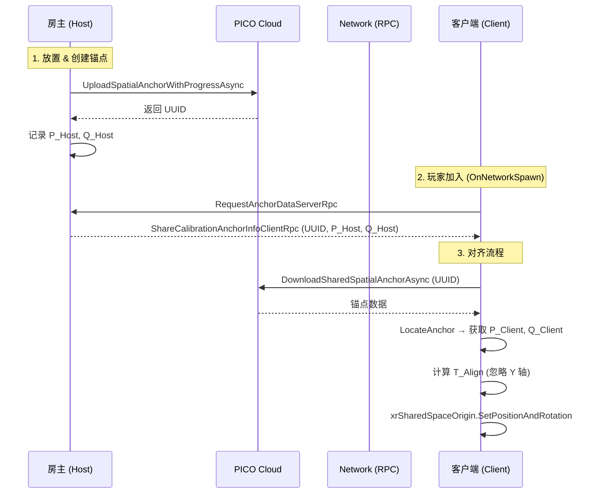

## 项目概览

在 PICO 4 Ultra 头显上运行的**多人混合现实联机 Demo**：多台设备通过 PICO 共享空间锚点把各自的 XR 坐标系对齐到同一真实物理空间，玩家能在同一个真实房间里看到精确重叠的虚拟内容，并实时交互。

这是把「多人 MR 坐标系统一」这个底层难题做成完整工程解的项目：从锚点放置、云端上传、跨设备定位，到刚体变换对齐、漂移自愈、地面网格同步，每条链路都有对应的容错与稳定性保障。

## 核心能力

| 功能 | 说明 |
|------|------|
| 多人联机 | Netcode for GameObjects + UnityTransport UDP，局域网 Host/Client，两台及以上 PICO 4 Ultra 实时联机 |
| 共享空间锚点标定 | 主机手柄预览放置 → 创建 / 持久化 / 上传 PICO 云端 → 广播 UUID 给所有客户端 |
| 坐标系对齐 | 客户端下载锚点、测量本地位姿，与主机位姿求刚体变换，整体搬正 XR Origin，使各端坐标系精确对齐到同一物理基准 |
| 玩家化身同步 | 头部位置 + 双手 Transform 实时镜像，客户端权威 NetworkTransform 广播给所有端 |
| MR 透视（VST） | PICO 4 Ultra 前置摄像头透视，虚拟内容叠加真实环境 |
| 真实地面同步 | 透视开启后扫描地面 Mesh，主机把顶点 / 索引广播给所有客户端，双端地面一致 |
| 漂移自愈 | 订阅 SDK 锚点更新事件，自动重算对齐，持续修正累积漂移，无需手动重标定 |
| 容错与补发 | 上传失败递增延迟重试；中途加入的客户端主动拉取锚点，无需重启房间 |

## 多人对齐数据流

整套系统运行时存在三条并行数据流：**① 空间锚点对齐**（主机锚点位姿经 PICO 云端同步到客户端，客户端重算 XR Origin，是另两条流的前提）、**② 玩家化身同步**（头部 + 双手 Transform 每帧通过 UDP 广播）、**③ 地面网格同步**（主机扫描真实地面，一次性推送顶点数组）。启动顺序：流 ① 对齐完成后，流 ② 化身、流 ③ 地面才能落到正确的物理位置。




## 对齐的核心：一次把世界搬正

由于主机与客户端测量的是**同一个真实物理点**，两端坐标系之间必然存在唯一的刚体变换。求出旋转差与位置差后，不逐个移动场景里的物体，而是把整个客户端 XR 坐标系的**根节点一次搬正**，挂在其下的化身、地面、虚拟对象全部自动落到正确的真实物理位置。两端都用 Floor 模式追踪、Y 轴沿重力对齐，因此强制锁地、丢弃高度测量误差，避免「玩家整体浮空或陷地」：

```csharp
// 旋转差：把客户端锚点朝向"扭"成主机锚点朝向
Quaternion rotAlign = hostRot * Quaternion.Inverse(clientRot);
// 位置差：补偿旋转之后锚点所在位置
Vector3 posAlign = hostPos - rotAlign * clientPos;
// Floor 模式两端 Y 轴已沿重力对齐，丢弃高度测量误差，强制锁地
posAlign.y = 0f;
// 写入客户端坐标系根节点，整个世界一次搬正
xrSharedSpaceOrigin.SetPositionAndRotation(posAlign, rotAlign);
```

SDK 底层优化锚点位姿时会触发更新事件，客户端收到后自动重新定位、重算对齐，并用平滑插值渐变而非跳变——长时间运行无累积漂移感知，无需手动重标定。

## 技术栈

| 层级 | 技术 | 版本 |
|------|------|------|
| 引擎 | Unity | 2022.3.62f2 LTS |
| 图形管线 | Universal Render Pipeline (URP) | 14 |
| 网络框架 | Netcode for GameObjects | 1.12.2 |
| 传输层 | Unity Transport (UDP) | — |
| XR 平台 | PICO Unity Integration SDK | 本地 file: 包 |
| UI / 交互 | Mixed Reality Toolkit 3 (MRTK3) | 本地 file: 包 |
| 构建目标 | Android (IL2CPP + ARM64) | PICO 4 Ultra |


## 使用限制

- 老老实实走 PICO 云端方案，锚点数据尽量不走本地（点云数据加密，解密成本高不值）
- 锚点传输核心依赖 UUID，放置、持久化、销毁均高度依赖 UUID
- 锚点预制体必须附带 PXR_Spatial Anchor 脚本
- 开始前需完成房间标定 + 地面高度标定，确保自身坐标真实
- 房主放置锚点后要缓慢平稳地环顾观察，确保上传充分；客户端确认房主上传完毕后再以房主视角核对

## 延伸阅读

::link{url="/posts/unitymr-spatial-anchor/" title="Unity-PICO-共享空间锚点开发" description="共享空间锚点的原理深挖：自身坐标标定、多人坐标系统一、空间锚点生命周期与完整对齐数学推导。"}
