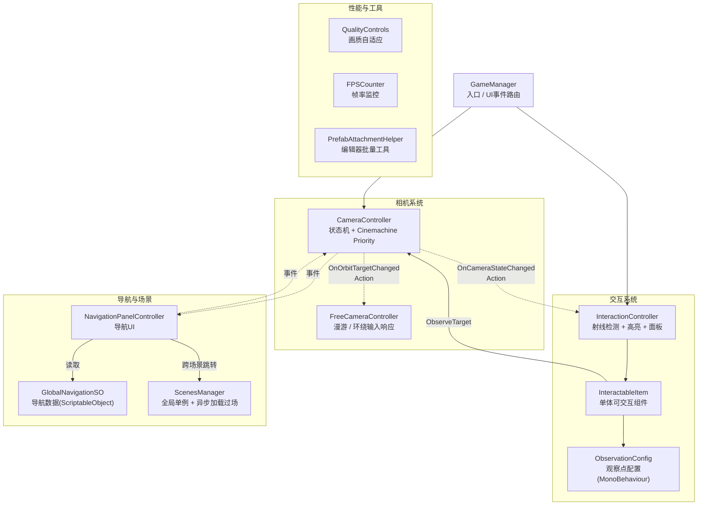
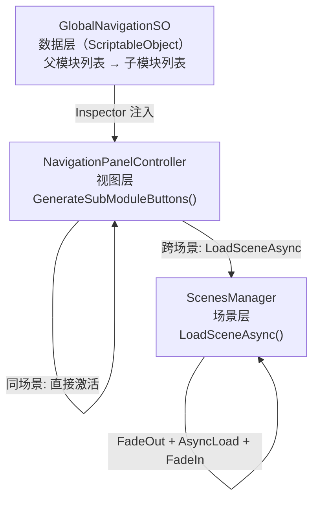

<!-- 建议在此放图:项目封面——校园全景俯瞰截图，体现数字孪生三维还原效果 -->

## 项目概览

「智慧校园」是一个基于 Unity 的 **3D 数字孪生 / 可视化系统**，将真实校园的建筑与智慧设备（监控、闸机、智慧体育、智慧餐厅等）以三维模型还原到场景中。用户可以在校园里自由漫游、点击任意建筑或设备进入环绕观察模式查看详情，并通过六大业务模块导航在多个场景之间跳转。

| 指标 | 数量 |
|------|------|
| 业务场景 | 4 个（校园 / 宿舍 / 教室 / 餐厅） |
| 自定义代码 | 约 **2828 行** |
| 核心脚本 | 12 个（Camera / Manager / UI / VisionController / Tools） |
| 自定义编辑器工具 | 1 个（`PrefabAttachmentHelper`，483 行） |
| 自定义 Shader | 1 个（`TechDiamondFlow.shader`，175 行 HLSL） |
| 相机状态 | 2 主状态（Initial / FreeFly）+ FreeFly 内 2 子模式（漫游 / 环绕） |
| 导航模块 | 6 大父模块 + 若干子模块（数据驱动） |

---

## 为什么要做

传统校园导览要么是静态图册，要么是预录视频——用户无法自主探索。本项目尝试回答一个问题：**能不能用一套可扩展的工程框架，把真实校园的空间感与智慧设备的信息密度都搬进实时 3D？**

工程上的收益是双向的：

- **展示侧**：设备级交互信息面板、六大业务模块跨场景导航、科技感程序化 Shader 地面，共同构建沉浸式体验；
- **工程侧**：Cinemachine 状态机、ScriptableObject 数据驱动、事件解耦、自定义编辑器工具等实践，形成一套可复用的 Unity 客户端架构模板。

<!-- 建议在此放图:交互演示截图——点击设备后弹出信息面板与高亮描边效果 -->

---

## 核心能力

| 能力 | 实现方式 | 关键类 |
|------|---------|--------|
| 双状态相机 + 平滑过渡 | Cinemachine Priority 仲裁 + 协程 + AnimationCurve | `CameraController.cs` (200 行) |
| 自由漫游 / 环绕观察 | FreeFly 双子模式、输入层完全封装 | `FreeCameraController.cs` (357 行) |
| 基于包围盒的对象对焦 | `Renderer.bounds.Encapsulate` 计算视觉中心 | `FreeCameraController.cs:123` |
| 动态缩放限制（三级回退） | SO 配置 → Inspector 覆写 → 全局默认 | `FreeCameraController.cs:102` |
| 设备高亮 + 射线检测 | HighlightPlus + `IsPointerOverGameObject` 防穿透 | `InteractionController.cs` (298 行) |
| 多级数据回退 | SO → Inspector 覆写 → 硬编码默认 | `InteractableItem.cs:118` |
| ScriptableObject 数据驱动导航 | `GlobalNavigationSO` + 运行时动态生成按钮 | `NavigationPanelController.cs` (469 行) |
| 跨场景静态字段传参 | `_pendingModuleToLoad` 静态字段 + 新场景消费清空 | `NavigationPanelController.cs:57` |
| 异步场景加载 + 渐黑过场 | `LoadSceneAsync` + `unscaledDeltaTime` | `ScenesManager.cs` (260 行) |
| 程序化 HLSL 科技地面 | `TechDiamondFlow.shader` 45° 菱形 + 双层流动 + 脉冲呼吸 | `TechDiamondFlow.shader` (175 行) |
| 画质自适应 | C# 9 关系模式匹配按显存选档 | `QualityControls.cs:26` |
| 编辑器批量挂载工具 | `PrefabAttachmentHelper` EditorWindow + Undo + 正则过滤 | `PrefabAttachmentHelper.cs` (483 行) |

---

## 技术核心

### 整体架构

项目采用 **组件解耦 + 事件驱动 + 数据驱动** 架构，由 `GameManager` 作为入口路由 UI 事件到各子系统，模块间通过 C# `Action` 事件与 ScriptableObject 数据解耦。



> 实线为直接依赖（Inspector 注入 / 方法调用），虚线为 C# `Action` 事件订阅（单向解耦）。

---

### 深度解析一：双状态相机系统

<!-- 建议在此放图:相机状态机示意图——Initial 全景模式与 FreeFly 环绕模式的视角对比截图 -->

项目的相机系统分为两个主状态：`Initial`（全景俯视）和 `FreeFly`（自由漫游/环绕观察），FreeFly 内部还有漫游与环绕两个子模式。切换不使用传统的 `SetActive`，而是通过 **Cinemachine Priority 仲裁**实现无缝混合过渡。

<details>
<summary>Cinemachine Priority 仲裁 — UpdatePriorities（CameraController.cs:195）</summary>

不通过 `SetActive` 切换虚拟相机，而是动态调整 Priority，让 Cinemachine 的混合系统自动处理过渡，彻底避免了"切画面跳帧"问题：

```csharp
// CameraController.cs:195-199
private void UpdatePriorities()
{
    initialCamera.Priority = (CurrentState == CameraState.Initial) ? 20 : 10;
    freeFlyCamera.Priority = (CurrentState == CameraState.Initial) ? 10 : 20;
}
```

对应的事件定义（CameraController.cs:37-38）：

```csharp
public event Action<CameraState> OnCameraStateChanged;
public event Action<Transform> OnOrbitTargetChanged;
```

</details>

<details>
<summary>协程 + AnimationCurve 平滑过渡 — MoveCameraToObservationPoint（CameraController.cs:136）</summary>

点击设备后，相机不会直接跳转，而是通过协程配合 `AnimationCurve` 在 `transitionDuration` 时间内平滑插值到目标观察点。关键是 **先预计算 LookRotation**，保证过渡开始时方向已正确对准目标：

```csharp
// CameraController.cs:146-156（预计算朝向）
Vector3 directionToTarget = orbitTarget.position - observationPoint.position;
Quaternion targetRotation = (directionToTarget != Vector3.zero)
    ? Quaternion.LookRotation(directionToTarget)
    : observationPoint.rotation;
```

过渡循环中使用 `Slerp` + `AnimationCurve.Evaluate` 保证缓动效果，并通过 `IsTransitioning` 标志位防止中途被打断：

```csharp
// CameraController.cs:162-172（过渡主循环）
while (elapsed < transitionDuration)
{
    elapsed += Time.deltaTime;
    float t = _transitionCurve.Evaluate(elapsed / transitionDuration);
    freeFlyCamera.transform.position = Vector3.Lerp(startPos, observationPoint.position, t);
    freeFlyCamera.transform.rotation = Quaternion.Slerp(startRot, targetRotation, t);
    yield return null;
}
```

</details>

<details>
<summary>基于包围盒的视觉中心计算 — GetRendererBoundsCenter（FreeCameraController.cs:123）</summary>

环绕观察时，相机轨道的圆心并非对象的 `Transform.position`，而是动态计算所有子 Renderer 的包围盒几何中心，保证多 Mesh 的复杂模型也能被精准对焦：

```csharp
// FreeCameraController.cs:123-133
private Vector3 GetRendererBoundsCenter(Transform target)
{
    var renderers = target.GetComponentsInChildren<Renderer>();
    if (renderers.Length == 0) return target.position;

    Bounds bounds = renderers[0].bounds;
    for (int i = 1; i < renderers.Length; i++)
        bounds.Encapsulate(renderers[i].bounds);

    return bounds.center;
}
```

动态缩放限制采用**三级优先回退**（FreeCameraController.cs:102-121）：SO 配置文件 → Inspector 直接覆写 → 全局硬编码默认值，既保证灵活性又有兜底安全。

</details>

<!-- 建议在此放图:SceneView Gizmos 截图——三色同心环（青=Initial观察距离，红=最小缩放，绿=最大缩放）直观展示配置范围 -->

---

### 深度解析二：TechDiamondFlow HLSL Shader

<!-- 建议在此放图:Shader 效果截图——科技菱形流光地面，体现加法混合的发光与脉冲呼吸效果 -->

`TechDiamondFlow.shader` 是项目唯一的手写 URP HLSL 着色器（175 行），实现「科技菱形流动地面」视觉效果。核心设计：45° UV 旋转生成菱形网格、双层流动叠加、正弦脉冲呼吸、加法混合模拟发光。

<details>
<summary>45° UV 旋转 + 程序化菱形网格 — DiamondGrid 函数（TechDiamondFlow.shader:110）</summary>

菱形网格通过将 UV 旋转 45° 再采样生成，无需贴图，完全程序化：

```hlsl
// TechDiamondFlow.shader:110-128 · DiamondGrid 函数
float2 DiamondGrid(float2 uv, float scale)
{
    // 45° 旋转矩阵：cos45=sin45=0.70710678
    float2 rotated = float2(uv.x + uv.y, uv.x - uv.y) * 0.70710678;
    float2 scaled = rotated * scale;

    float2 f = frac(scaled) - 0.5;
    float diamond = abs(f.x) + abs(f.y);   // L1 范数 → 菱形等高线

    float grid = smoothstep(_LineWidth + _LineSmooth, _LineWidth, diamond);
    return float2(grid, diamond);
}
```

</details>

<details>
<summary>双层流动 + 脉冲呼吸（TechDiamondFlow.shader:137）</summary>

两个独立的菱形网格层以不同的缩放、速度和 Y 轴偏移流动，叠加后产生「扫光」感：

```hlsl
// TechDiamondFlow.shader:137-150 · 双层流动
float2 uv1 = uv + float2(_FlowDirX, _FlowDirY) * _Time.y * _FlowSpeed;
float2 uv2 = uv + float2(_FlowDirX, _FlowDirY) * _Time.y * _FlowSpeed2
           + float2(0, _LayerOffset);

float2 grid1 = DiamondGrid(uv1, _GridScale);
float2 grid2 = DiamondGrid(uv2, _GridScale2);

float combined = saturate(grid1.x * _Layer1Intensity + grid2.x * _Layer2Intensity);
```

脉冲呼吸效果通过正弦函数驱动亮度：

```hlsl
// TechDiamondFlow.shader:152-156 · 正弦脉冲呼吸
float t = _Time.y * _PulseSpeed;
float pulse = lerp(1.0 - _PulseIntensity, 1.0, sin(t) * 0.5 + 0.5);
float brightness = combined * pulse;
```

最终以**加法混合**（`Blend SrcAlpha One`）输出，让亮区在 HDR 渲染管线中自然触发 Bloom：

```hlsl
// TechDiamondFlow.shader:163-167 · 最终输出
half3 color = lerp(_BaseColor.rgb, _FlowColor.rgb, combined) * _ColorIntensity;
return half4(color * brightness, saturate(brightness));
```

</details>

<!-- 建议在此放图:Shader Graph 或 Material Inspector 截图——展示 HDR FlowColor 属性与 Pulse 参数调节面板 -->

着色器通过 `CBUFFER_START(UnityPerMaterial)` 声明所有属性，完整兼容 **SRP Batcher**，在大场景中不产生额外 DrawCall 开销。`[HDR]` 颜色属性让 `_FlowColor` 超亮值能在 URP Post Processing 中直接激活 Bloom，无需额外配置。

---

### 深度解析三：ScriptableObject 数据驱动导航

<!-- 建议在此放图:导航面板截图——六大父模块按钮与展开的子模块列表 -->

导航系统采用三层架构：`GlobalNavigationSO`（数据）→ `NavigationPanelController`（视图）→ `ScenesManager`（场景加载）。修改导航结构只需编辑 SO 资产，无需改代码。



<details>
<summary>GlobalNavigationSO 数据结构（GlobalNavigationSO.cs）</summary>

```csharp
// GlobalNavigationSO.cs（完整，35 行）
[CreateAssetMenu(fileName = "GlobalNavigationSO", menuName = "智慧校园/GlobalNavigationSO")]
public class GlobalNavigationSO : ScriptableObject
{
    [System.Serializable]
    public class SubModuleData
    {
        public string buttonName;
        public string targetItemId;
    }

    [System.Serializable]
    public class ParentModuleData
    {
        public string moduleName;
        [TextArea] public string moduleText;
        [TextArea] public string moduleDescription;
        public string targetSceneName;
        public List<SubModuleData> subModules;
    }

    public List<ParentModuleData> parentModules = new List<ParentModuleData>();
}
```

</details>

<details>
<summary>运行时动态生成子模块按钮 + 闭包陷阱修复（NavigationPanelController.cs:310）</summary>

按钮在运行时由代码动态实例化，按钮点击事件注册时存在经典 **foreach 闭包捕获陷阱**——若直接使用 `subModule.targetItemId`，所有按钮的点击回调都会捕获循环结束后的同一引用。项目通过声明局部变量解决：

```csharp
// NavigationPanelController.cs:328 · 闭包陷阱修复
foreach (var subModule in parentModule.subModules)
{
    // 关键：在循环体内声明局部变量，让每个闭包捕获独立副本
    string targetId = subModule.targetItemId;  // ← 修复闭包捕获
    string btnName = subModule.buttonName;

    var btn = Instantiate(_subModuleButtonPrefab, _subModuleContainer);
    btn.GetComponentInChildren<TMP_Text>().text = btnName;
    btn.GetComponent<Button>().onClick.AddListener(() =>
    {
        OnSubModuleClicked(targetId);   // 捕获独立副本，每个按钮行为正确
    });
}
```

</details>

<details>
<summary>跨场景静态字段传参 + 消费清空模式（NavigationPanelController.cs:57）</summary>

Unity 场景加载会销毁旧的 `NavigationPanelController` 实例，导致普通字段无法跨场景传递"待激活模块"信息。项目用**静态字段**作为临时信使：

```csharp
// NavigationPanelController.cs:57-58 · 静态字段声明
private static string _pendingModuleToLoad;
private static string _pendingSubModuleToLoad;
```

跨场景跳转时写入，新场景 `Start` 等一帧后消费并清空，防止重复触发：

```csharp
// NavigationPanelController.cs:99-104 · 消费清空模式
private IEnumerator ConsumePendingModule()
{
    yield return null;  // 等一帧，确保场景完全初始化
    if (_pendingModuleToLoad != null)
    {
        string moduleToLoad = _pendingModuleToLoad;
        _pendingModuleToLoad = null;  // 先清空，防止重复消费
        ActivateModule(moduleToLoad);
    }
}
```

`ScenesManager.LoadSceneAsync` 实现渐黑过场，全程使用 `Time.unscaledDeltaTime` 保证即便 `TimeScale = 0` 时动画也能正常播放，加载进度以 `op.progress / 0.9f` 归一化（Unity 异步加载到 90% 时暂停等待激活）：

```csharp
// ScenesManager.cs:229 · 进度归一化
loadingProgress = Mathf.Clamp01(op.progress / 0.9f);
```

</details>

<!-- 建议在此放图:跨场景切换过场截图——渐黑遮罩覆盖全屏，右下角显示加载进度条 -->

---

## 架构说明

| 模块 | 类型 | 核心职责 | 行数 |
|------|------|---------|------|
| `CameraController` | 状态机 | 相机状态切换、观察点过渡协程、事件广播 | 200 |
| `FreeCameraController` | 输入层 | 漫游 / 环绕双模式输入、动态缩放、边界约束 | 357 |
| `InteractionController` | 交互 | 射线检测、高亮切换、信息面板动画 | 298 |
| `InteractableItem` | 组件 | 单体高亮代理、多级数据回退、Gizmos 可视化 | 250 |
| `ObservationConfig` | 配置 | 场景级观察点与元数据集中管理（MonoBehaviour，持 Transform 引用） | 74 |
| `NavigationPanelController` | UI | 动态生成子模块按钮、跨场景导航、闭包修复 | 469 |
| `GlobalNavigationSO` | 数据 | 父 / 子模块导航结构（ScriptableObject） | 35 |
| `ScenesManager` | 单例 | 异步加载、渐黑过场、跨场景 UI 重绑（DontDestroyOnLoad） | 260 |
| `QualityControls` | 性能 | 按显存自适应画质（C# 9 关系模式匹配） | 123 |
| `FPSCounter` | 调试 | 帧率监控与颜色分级（`unscaledDeltaTime` + 双显示路径） | 75 |
| `PrefabAttachmentHelper` | 工具 | 批量挂载预制体，支持前缀扫描、正则后缀过滤、Undo | 483 |
| `PrefabAttachMarker` | 标记 | 空 MonoBehaviour，标记已挂载实例（Marker Pattern） | 9 |
| `TechDiamondFlow.shader` | 着色器 | URP HLSL 科技菱形流动地面，SRP Batcher 兼容 | 175 |

**技术栈版本**

| 类别 | 技术 / 插件 | 版本 |
|------|------------|------|
| 引擎 | Unity | 2022.3.62f2 LTS |
| 渲染管线 | URP | 14.0.12 |
| 相机框架 | Cinemachine | 2.10.7 |
| 曲线 | Splines | 2.8.4 |
| 文本 | TextMeshPro | 3.0.7 |
| 版本控制 | Plastic SCM | — |
| 高亮 | HighlightPlus | — |
| 反射 | ShinySSRR | — |
| 视频 | AVProVideo | — |

---

## 使用限制

- 本项目使用 **Plastic SCM** 进行版本控制，不在 GitHub 公开发布，无法通过 `git clone` 获取；
- **HighlightPlus**、**ShinySSRR**、**AVProVideo** 为付费插件，需在 Asset Store 自行购买并导入；
- 场景内三维模型（建筑、设备）均为项目定制资产，不包含在通用模板中；
- Unity 版本必须为 **2022.3.x LTS**，低版本不支持 C# 9 关系模式匹配语法（`case <= 2048:`）及 `FindObjectsByType<T>(FindObjectsSortMode.None)` API；
- `TechDiamondFlow.shader` 依赖 **URP 14** 的 `UniversalForward` Pass 与 `CBUFFER_START(UnityPerMaterial)` 宏，内置管线无法直接使用；
- 画质自适应以**显存大小**作为判断依据，虚拟机 / 集成显卡环境下显存检测可能不准确。
