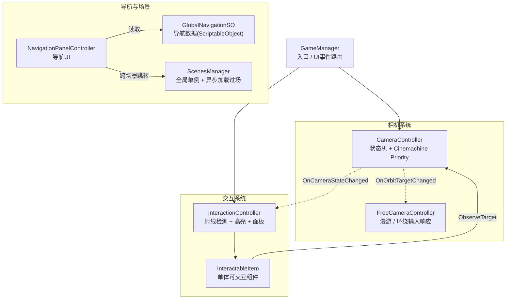

<!-- 建议在此放图:项目封面——校园全景俯瞰截图，体现数字孪生三维还原效果 -->

## 项目概览

「智慧校园」是一个基于 Unity 的 **3D 数字孪生 / 可视化系统**，将真实校园的建筑与智慧设备（监控、闸机、智慧体育、智慧餐厅等）以三维模型还原到场景中。用户可以在校园里自由漫游、点击任意建筑或设备进入环绕观察模式查看详情，并通过六大业务模块导航在多个场景之间跳转。

| 指标 | 数量 |
|------|------|
| 业务场景 | 4 个（校园 / 宿舍 / 教室 / 餐厅） |
| 相机状态 | 2 主状态（Initial / FreeFly）+ FreeFly 内 2 子模式（漫游 / 环绕） |
| 导航模块 | 6 大父模块 + 若干子模块（数据驱动） |

<!-- 建议在此放图:交互演示截图——点击设备后弹出信息面板与高亮描边效果 -->

## 核心能力

| 能力 | 一句话说明 |
|------|---------|
| 双状态相机 + 平滑过渡 | Initial 全景与 FreeFly 漫游/环绕之间用 Cinemachine Priority 仲裁无缝切换 |
| 物体高亮与观察逻辑 | 射线检测 + UI 遮挡防穿透 + 单一出口的高亮状态管理 + 基于包围盒几何中心的对焦 |
| SSRR2 镜面反射 | 集成 ShinySSRR2 屏幕空间反射，提升地面与玻璃的镜面质感 |
| 数据驱动导航 | ScriptableObject 配置 + 运行时动态生成 UI 按钮 + 跨场景传参，改导航只需改资产 |
| 异步场景加载 | 渐黑过场 + 进度归一化，跨场景切换不黑屏跳变 |
| 画质自适应 | 按显存大小自动选择画质档，低配设备也能流畅运行 |
| 编辑器批量工具 | 自定义 EditorWindow 批量挂载预制体，支持正则过滤与 Undo |

## 整体架构

项目采用 **组件解耦 + 事件驱动 + 数据驱动** 架构，由 `GameManager` 作为入口路由 UI 事件到各子系统，模块间通过 C# `Action` 事件与 ScriptableObject 数据解耦。



> 实线为直接依赖（Inspector 注入 / 方法调用），虚线为 C# `Action` 事件订阅（单向解耦）。

## 一个关键设计：相机状态仲裁

相机分 `Initial`（全景俯视）与 `FreeFly`（自由漫游 / 环绕）两个主状态。切换不用传统的 `SetActive`，而是动态调整 Cinemachine 虚拟相机的 Priority，让混合系统自动处理过渡，彻底避免「切画面跳帧」：

```csharp
private void UpdatePriorities()
{
    initialCamera.Priority = (CurrentState == CameraState.Initial) ? 20 : 10;
    freeFlyCamera.Priority = (CurrentState == CameraState.Initial) ? 10 : 20;
}
```

点击设备后，相机再配合协程 + `AnimationCurve` 平滑插值到观察点；环绕的轨道圆心取子 Renderer 包围盒的几何中心，而非物体原点，保证多 Mesh 的复杂建筑也能精准对焦。

<!-- 建议在此放图:相机状态机示意——Initial 全景模式与 FreeFly 环绕模式的视角对比截图 -->

## 技术栈

| 类别 | 技术 / 插件 | 版本 |
|------|------------|------|
| 引擎 | Unity | 2022.3.62f2 LTS |
| 渲染管线 | URP | 14.0.12 |
| 相机框架 | Cinemachine | 2.10.7 |
| 高亮 | HighlightPlus | — |
| 反射 | ShinySSRR2 | — |
| 文本 | TextMeshPro | 3.0.7 |
| 视频 | AVProVideo | — |
| 版本控制 | Plastic SCM | — |

## 使用限制

- 本项目使用 **Plastic SCM** 进行版本控制，不在 GitHub 公开发布，无法通过 `git clone` 获取；
- **HighlightPlus**、**ShinySSRR2**、**AVProVideo** 为付费插件，需在 Asset Store 自行购买并导入；
- 场景内三维模型（建筑、设备）均为项目定制资产，不包含在通用模板中；
- Unity 版本需为 **2022.3.x LTS**，低版本不支持 C# 9 关系模式匹配语法；
- 画质自适应以**显存大小**作为判断依据，虚拟机 / 集成显卡环境下显存检测可能不准确。
